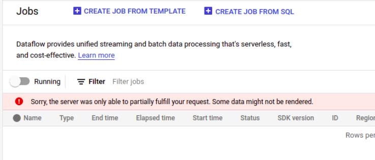

# Troubleshooting

## Issues

- [The server was only able to partially fulfill your request](#the-server-was-only-able-to-partially-fulfill-your-request)
- [Template file failed to load](#template-file-failed-to-load)
- [The referenced network resource cannot be found](#the-referenced-network-resource-cannot-be-found)
- [Unable to open the Dataflow staging file](#unable-to-open-the-dataflow-staging-file)
- [No matching distribution found for apache-beam==2.30.0](#no-matching-distribution-found-for-apache-beam2300)

### The server was only able to partially fulfill your request

This error message is shown on the **GCP Console** when trying to view resources protected by the VPC-SC [perimeters](https://cloud.google.com/vpc-service-controls/docs/service-perimeters), such as [Dataflow Jobs](https://console.cloud.google.com/dataflow/jobs).

**Error message:**

```console
Sorry, the server was only able to partially fulfill your request. Some data might not be rendered.
```



**Cause:**

You are not in the list of members of the access level associated with the perimeter.

**Solution:**

You need to be added in the input `perimeter_additional_members` of the *Secured Data Warehouse Module*. Members of this list are added to the [access level](https://cloud.google.com/access-context-manager/docs/create-basic-access-level#members-example).

See the inputs section in the [README](../README.md#inputs) for more details.

### Template file failed to load

This error message is shown on the **GCP Console** when you are [creating](https://console.cloud.google.com/dataflow/createjob) a new Dataflow Job.

**Error message:**

```console
The metadata file for this template could not be parsed.
    VIEW DETAILS
```

In **VIEW DETAILS**:

```console
Fail to process as Flex Template and Legacy Template. Flex Template Process result:(390ac373ef6bcb87):
Template file failed to load: gs://<BUCKET-NAME>/flex-template-samples/regional-python-dlp-flex.json.
Permissions denied. Request is prohibited by organization's policy. vpcServiceControlsUniqueIdentifier: <UNIQUE-IDENTIFIER>,
Legacy Template Process result:(390ac373ef6bc2a5): Template file failed to load: gs://<BUCKET-NAME>/flex-template-samples/regional-python-dlp-flex.json.
Permissions denied. Request is prohibited by organization's policy. vpcServiceControlsUniqueIdentifier: <UNIQUE-IDENTIFIER>
```

**Cause:**

The private Dataflow job template that is being used is outside of the VPC-SC Perimeter. Use the [troubleshooting page](https://console.cloud.google.com/security/service-perimeter/troubleshoot-landing) to [debug](https://cloud.google.com/vpc-service-controls/docs/troubleshooting#debugging) the details regarding the violation.

**Solution:**

The identity deploying the Dataflow jobs must be added to the correct list indicated below. The list configures egress rules that allows the Dataflow templates to be fetched.

- For the **confidential perimeter**, the identity needs to be added in the input `confidential_data_dataflow_deployer_identities` of the *Secured Data Warehouse Module*.
- For the **data ingestion perimeter**, the identity needs to be added in the input `data_ingestion_dataflow_deployer_identities` of the *Secured Data Warehouse Module*.

See the inputs section in the [README](../README.md#inputs) for more details.

### The referenced network resource cannot be found

This error message is shown in the Dataflow jobs details page for the deployed Dataflow Job, in the `Job Logs` section.

**Error message:**

```console
Failed to start the VM, launcher-2021120604300713065380799072320283, used for launching because of status code: INVALID_ARGUMENT, reason:
Error: Message: Invalid value for field 'resource.networkInterfaces[0].network': 'global/networks/default'.
The referenced network resource cannot be found. HTTP Code: 400.
```

or

```console
Failed to start the VM, launcher-2021120906191814752290113584255576, used for launching because of
status code: INVALID_ARGUMENT, reason:
Error: Message: Invalid value for field 'resource.networkInterfaces[0]': '{ "network": "global/networks/default", "accessConfig": [{ "type": "ONE_TO_ONE_NAT", "name":...'.
Subnetwork should be specified for custom subnetmode network HTTP Code: 400.
```

**Cause:**

If you do not specify a **network** or **subnetwork** in the job parameters, Dataflow will use the [default VPC network](https://cloud.google.com/dataflow/docs/guides/specifying-networks#specifying_a_network_and_a_subnetwork) to deploy the Job.
If the default network does not exist, you will get the 400 error.

**Solution:**

A valid **VPC subnetwork** must be declared as a job parameter in the creation of the Dataflow Job, as you can see in the regional-dlp [example](../examples/regional-dlp/main.tf#L99) that uses the dataflow-flex-job [module](../modules/dataflow-flex-job/README.md).

- **GCP Console**: Use the optional parameter `Subnetwork`.
- **Gcloud CLI**: Use the optional flag [--subnetwork](https://cloud.google.com/sdk/gcloud/reference/dataflow/jobs/run#--subnetwork).
- **Terraform**: Use the input `subnetwork_self_link` from the [Dataflow Flex Job Module](../modules/dataflow-flex-job/README.md#inputs).

### Unable to open the Dataflow staging file

An user deploys a new Dataflow job in the console and the job creation fails.
Looking at the **Job Logs** section, in the bottom part of the job detail page, there is an error with the message:

**Error message:**

```console
Failed to read the result file : gs://<BUCKET-NAME>/staging/template_launches/ 2021-12-06_04_37_18-105494327517795773/
operation_result with error message: (59b58cff2e1b7caf): Unable to open template file:
gs://<BUCKET-NAME>/staging/template_launches/ 2021-12-06_04_37_18-105494327517795773/ operation_result..
```

**Cause:**

You did not specify the appropriate Service Account created by the main module as the Dataflow [Worker Service Account](https://cloud.google.com/dataflow/docs/concepts/security-and-permissions#worker_service_account) in the parameters, the Dataflow job will use the [Compute Engine default service account](https://cloud.google.com/dataflow/docs/concepts/security-and-permissions#default_worker_service_account) as the Dataflow Worker Service Account.

**Solution:**

You must use the appropriate Service Account created by the main module.

- Data ingestion:
  - Module output: `dataflow_controller_service_account_email`
  - Email format: `sa-dataflow-controller@<DATA-INGESTION-PROJECT-ID>.iam.gserviceaccount.com`
- Confidential Data:
  - Module output: `confidential_dataflow_controller_service_account_email`
  - Email format: `sa-dataflow-controller-reid@<CONFIDENTIAL-DATA-PROJECT-ID>.iam.gserviceaccount.com`

The **Service Account** must be declared as a job parameter.

- **GCP Console**: Use the *optional* parameter **Service account email**.
- **Gcloud**: Use the optional flag [--service-account-email](https://cloud.google.com/sdk/gcloud/reference/dataflow/jobs/run#--service-account-email).
- **Terraform**: Use the input `service_account_email` from the [Dataflow Flex Job Module](../modules/dataflow-flex-job/README.md#inputs).

For more details about Dataflow staging files see [Resource usage and management](https://cloud.google.com/dataflow/docs/guides/deploying-a-pipeline#resource-usage-and-management) documentation.

### No matching distribution found for apache-beam==2.30.0

An user deploys a new Dataflow job in the console and the job creation fails.
Looking at the **Job Logs** section, in the bottom part of the job detail page, there is an error with the message:

**Error message:**

```console
https://LOCATION-python.pkg.dev/ARTIFACT-REGISTRY-PROJECT-ID/python-modules/simple/
ERROR: Could not find a version that satisfies the requirement apache-beam==2.30.0 (from versions: none)
ERROR: No matching distribution found for apache-beam==2.30.0
```

**Cause:**

The Dataflow [Worker Service Account](https://cloud.google.com/dataflow/docs/concepts/security-and-permissions#worker_service_account) is trying to access the [Artifact Registry](https://cloud.google.com/artifact-registry/docs/python/quickstart) to download the **Apache Beam module** but do not have the right permissions to access it.

**Solution:**

You must grant the role Artifact Registry Reader (`roles/artifactregistry.reader`) in the Artifact Registry Repository, that hosts the Python modules, to the Dataflow Worker Service Account.

You must use the appropriate Service Account created by the main module.

- Data ingestion:
  - Module output: `dataflow_controller_service_account_email`
  - Email format: `sa-dataflow-controller@<DATA-INGESTION-PROJECT-ID>.iam.gserviceaccount.com`
- Confidential Data:
  - Module output: `confidential_dataflow_controller_service_account_email`
  - Email format: `sa-dataflow-controller-reid@<CONFIDENTIAL-DATA-PROJECT-ID>.iam.gserviceaccount.com`

Using gcloud command:

```console
export project_id=<ARTIFACT-REGISTRY-PROJECT-ID>
export location=<ARTIFACT-REGISTRY-REPOSITORY-LOCATION>
export dataflow_worker_service_account=<DATAFLOW-WORKER-SERVICE-ACCOUNT>

gcloud artifacts repositories add-iam-policy-binding python-modules \
--member="serviceAccount:${dataflow_worker_service_account}"  \
--role='roles/artifactregistry.reader' \
--project=${project_id} \
--location=${location}
```

Using terraform:

```hcl
resource "google_artifact_registry_repository_iam_member" "python_reader" {
  provider = google-beta

  project    = <ARTIFACT-REGISTRY-PROJECT-ID>
  location   = <ARTIFACT-REGISTRY-REPOSITORY-LOCATION>
  repository = "python-modules"
  role       = "roles/artifactregistry.reader"
  member     = "serviceAccount:<DATAFLOW-WORKER-SERVICE-ACCOUNT>"
}
```
